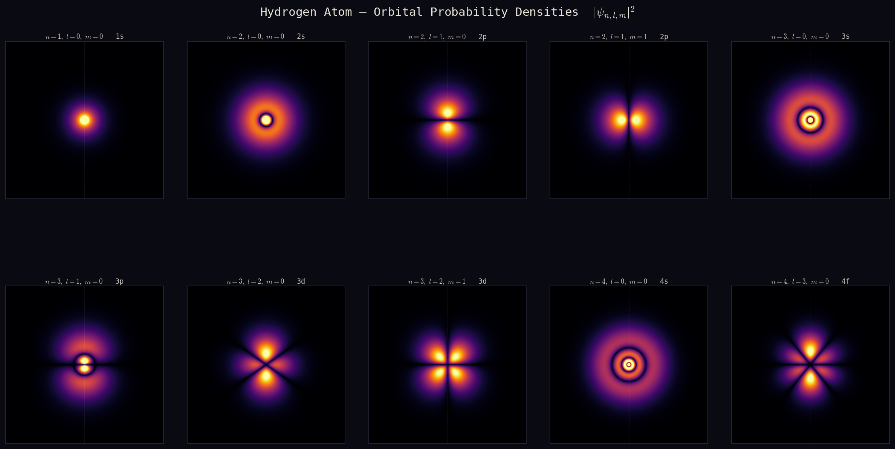

# Atom Simulation in C++



This project calculates and visualizes the quantum mechanical wavefunction of a hydrogen atom. It uses a high-performance C++ backend to compute the complex spatial probability densities and a Python script to generate the final plots.
## Getting Started
Follow these steps to compile the backend and generate the visualization.
### 1. Compute the Wavefunction
```bash
g++ -O3 -std=c++17 -o hydrogen_wavefunction hydrogen_wavefunction.cpp -lm

./hydrogen_wavefunction

```
### 2. Plot the Results 
```bash
python hydrogen_plot.py

```
